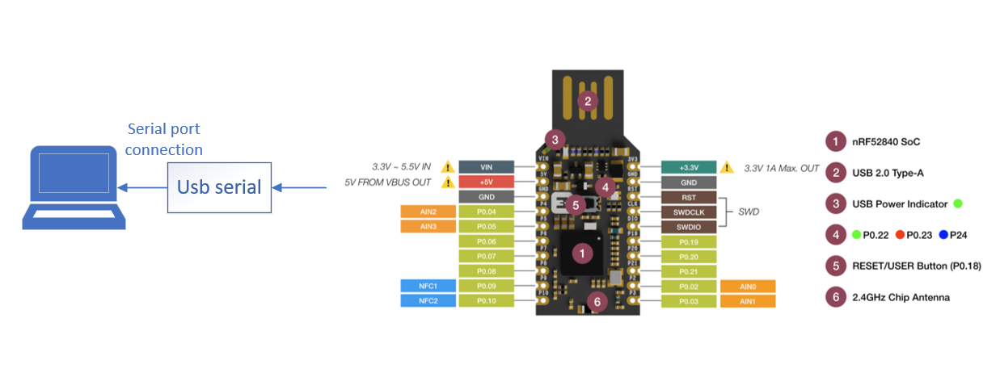
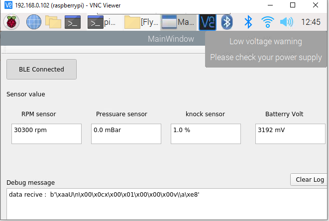

# Gui logger Sensor For Flyx
# Run with raspberry pi

This project will logger and show data receive from Flyx board:

#hardware connection for project:
| Dongle Pin   | Serial debug |
| ---          | ---          |
| P0.02 (TX)   |  UART RX     |

# Tool GUI

