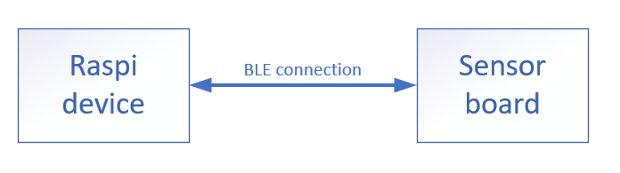
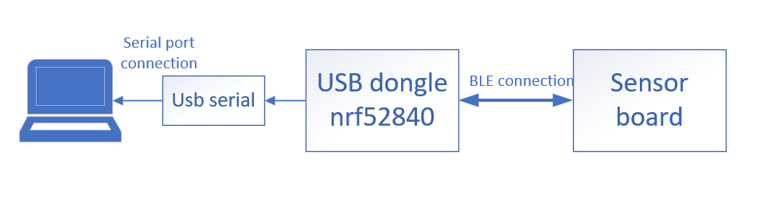

# Gui logger Sensor For Flyx
We have two firmware for GUI one for Raspi and other on for Linux
This project will logger and show data receive from Flyx board:
#Build the Project:
- Raspi_Gui: using bluetooth of the Raspi and connect with bluetooth device
- Linux_Gui: connect with bluetooth device via usb nrf52840 dongle and serial port

#How to connect raspi and device diagram

#How to connect laptop and device diagram
