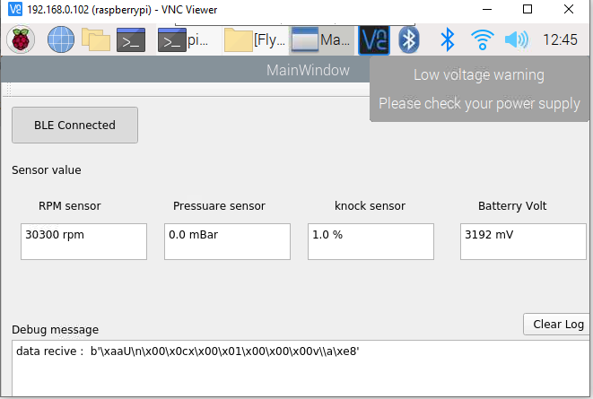

# Gui logger Sensor For Flyx
# Run with raspberry pi

This project will logger and show data receive from Flyx board:
build project:
- Install bluepy: sudo pip3 install bluepy
- Run project: sudo controller.py

